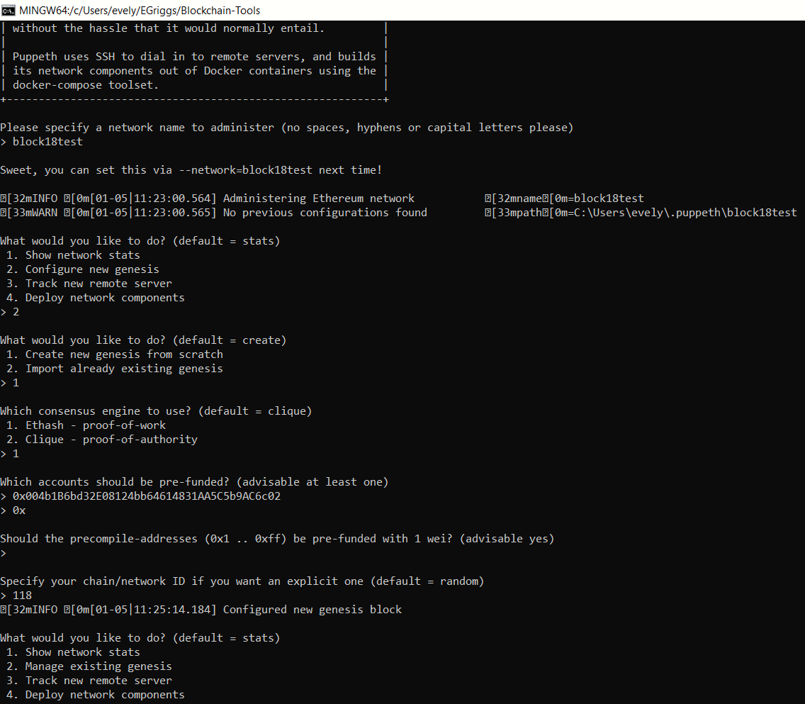
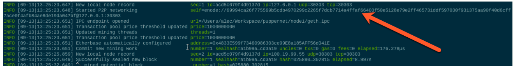
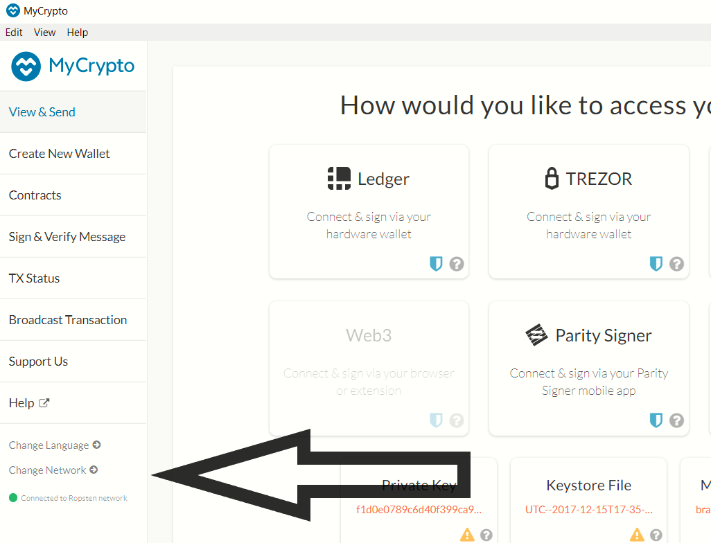
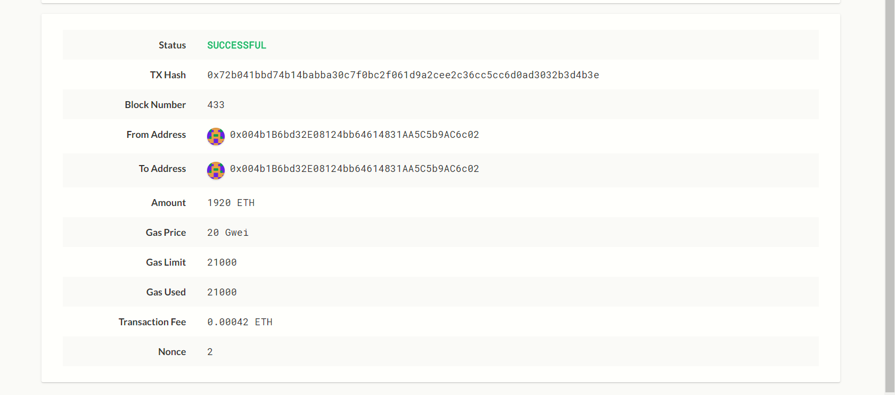

# ZBank Blockchain Testnet

### Setting up the Testnet

ZBank's MyCrytpo wallet will be using a custom network in order to demonstrate how a transaction is connected to the Testnet and Ethereum Tools. 

#### Utilizing Go Ethereum Tools: puppeth, geth, nodes, o'mine!

Ethereum tools allows us to build our blockchain beginning with the genesis block, mining tokens, and ultimately creating transactions with ZBank's prefunded MyCrypto(tm) wallet. 

Working through the terminal, the ./puppeth command gives us access to create Ethereum networks, in this case our network: block18test; configuring a new genesis; selecting proof of work as the consensus engine or algorithm.
./geth commands will create keys, initialize and connect nodes. 

- Create a genesis block for ZBank's blockchain testnet
- Utilize the public address from ZBank's MyCrypto Wallet

step 1: ./puppeth

step 2: follow prompts to:

- Configure new genesis `2`
- Create new genesis from scratch `1`
- Select Proof of work algorithm from consensus engine list `1`

step 3: name the network: block18test and assign the chainID: 118 

step 4: copy public address from ZBank's MyCrypto wallet `0x...` address, then enter again at the blank `0x` prompt

After creating data directories for the nodes, launching them into mining mode will facilitate a transaction with ZBanks MyCrypto wallet and the custom network we created with Ethereum tools' puppeth and geth commands.

- Creating data directories for nodes for mining

step 1: ./puppeth

step 2: follow prompts to:

- Manage existing genesis `2`
- Export genesis configurations `2`
- Enter to continue in block18test network `enter`

step 3: confirm that you have network block18test.json file listed 
 
- Exit puppeth `ctrl + c`

step 4: create nodes with `./geth account new`

-  node1: `--datadir node 1`

-  node2: `--datadir node 2`

- initialize nodes with `./geth init block18test.json --datadir node1`; `node2`

step 5: mining between nodes `1` and `2` with `node2` enabling an RPC port which allows for interaction with ZBank's MyCrypto Wallet

- launching node1: `./geth --datadir node1 --mine --minerthreads 1` 

- launching node2: `.geth --datadir node2 --port 30304 --rpc --bootnodes "enode://<node1 enode address>" --ipcdisable`

`--mine` tells the node to mine new blocks

`--minerthreads` refers to the CPU threads used during mining, for test reasons the diffifulty level is low and set to `1`

node2 will be launched in a separate terminal and from the same directory node1 was launched

When launching node2 the enode address will be copied from node1: 

output for node2 will provide information about `Imported new chain segment` and `Block synchronisation started`

#### Transaction with custom network: block18test, chainID: 118

Connecting the custom network and blockchain created with Ethereum tools to ZBank's MyCrypto wallet will require managing the wallet to acquire a private key.

- Unlock ZBank's wallet using the mnemonic phrase option

- Use the ETH address used to pre-fund block18test and select Wallet Info

- Clicking on the eye icon next to the "Private Key" field, copy the private key for testing our network transaction

- Connect MyCrypto with the custom newtork by selecting the "Change Network" tab in the app at the bottom left: 

- `Add Custom Node` to include ZBank's network: block18test and chainID: 118

- Set the currency to ETH

- confirm that URL is `http://127.0.0.1:8545`

- Navigate to View & Send on the left menu and select "Private Key" option when prompted about how to access your wallet

- Paste the "Private Key" you copied earlier

- Copy the pre-funded address connected to the block18test network for the "To Address" field and fill in any amount of ETH to test a transaction

> The prefunded address for block18test genesis block was acquired from the public addresses provided in MyCrypto wallet. A transaction can be demonstrated using this account, creating a custom node to include: network block18test, chainID 118, and the prefunded address.

An example of transaction Metadata is as follows:

